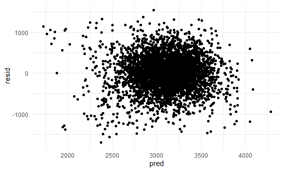
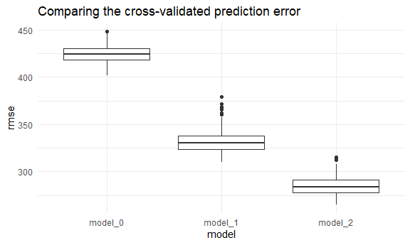
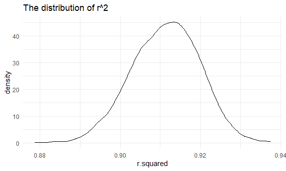
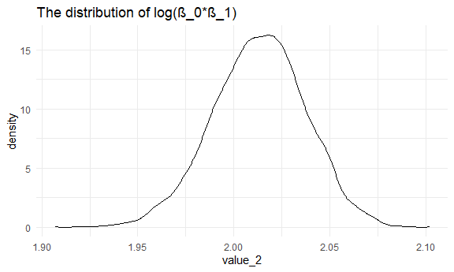

p8105_hw6_xz2981
================
Xinyan Zhou
12/1/2021

``` r
library(tidyverse)
```

    ## -- Attaching packages --------------------------------------- tidyverse 1.3.1 --

    ## v ggplot2 3.3.5     v purrr   0.3.4
    ## v tibble  3.1.4     v dplyr   1.0.7
    ## v tidyr   1.1.3     v stringr 1.4.0
    ## v readr   2.0.1     v forcats 0.5.1

    ## -- Conflicts ------------------------------------------ tidyverse_conflicts() --
    ## x dplyr::filter() masks stats::filter()
    ## x dplyr::lag()    masks stats::lag()

``` r
library(modelr)

knitr::opts_chunk$set(
  fig.width = 6,
  fig.asp = .6,
  out.width = "90%"
)

theme_set(theme_minimal() + theme(legend.position = "bottom"))

options(
  ggplot2.continuous.colour = "viridis",
  ggplot2.continuous.fill = "viridis"
)

scale_colour_discrete = scale_colour_viridis_d
scale_fill_discrete = scale_fill_viridis_d
```

## Problem 1

### Tidy data

Load and clean the data for regression analysis (i.e. convert numeric to
factor where appropriate, check for missing data, etc.).

``` r
birthweight = 
  read_csv("data/birthweight.csv") %>% 
  janitor::clean_names() %>%
  mutate(
    babysex = case_when(
      babysex  == 1 ~ "male",
      babysex  == 2 ~ "female",
      TRUE ~ "missing"),
    frace = case_when(
      frace == 1 ~ "White",
      frace == 2 ~ "Black",
      frace == 3 ~ "Asian",
      frace == 4 ~ "Puerto Rican",
      frace == 8 ~ "Other",
      frace == 9 ~ "Unknown",
      TRUE ~ "missing"),
     malform = case_when(
      malform == 0 ~ "absent",
      malform == 1 ~ "present",
      TRUE ~ "missing"),
     mrace = case_when(
      mrace == 1 ~ "White",
      mrace == 2 ~ "Black",
      mrace == 3 ~ "Asian",
      mrace == 4 ~ "Puerto Rican",
      TRUE ~ "missing")
    ) %>%
  mutate(babysex = factor(babysex),
         frace = factor(frace),
         malform = factor(malform),
         mrace = factor(mrace))
```

    ## Rows: 4342 Columns: 20

    ## -- Column specification --------------------------------------------------------
    ## Delimiter: ","
    ## dbl (20): babysex, bhead, blength, bwt, delwt, fincome, frace, gaweeks, malf...

    ## 
    ## i Use `spec()` to retrieve the full column specification for this data.
    ## i Specify the column types or set `show_col_types = FALSE` to quiet this message.

``` r
summary(birthweight)
```

    ##    babysex         bhead          blength           bwt           delwt      
    ##  female:2112   Min.   :21.00   Min.   :20.00   Min.   : 595   Min.   : 86.0  
    ##  male  :2230   1st Qu.:33.00   1st Qu.:48.00   1st Qu.:2807   1st Qu.:131.0  
    ##                Median :34.00   Median :50.00   Median :3132   Median :143.0  
    ##                Mean   :33.65   Mean   :49.75   Mean   :3114   Mean   :145.6  
    ##                3rd Qu.:35.00   3rd Qu.:51.00   3rd Qu.:3459   3rd Qu.:157.0  
    ##                Max.   :41.00   Max.   :63.00   Max.   :4791   Max.   :334.0  
    ##     fincome               frace         gaweeks         malform    
    ##  Min.   : 0.00   Asian       :  46   Min.   :17.70   absent :4327  
    ##  1st Qu.:25.00   Black       :1911   1st Qu.:38.30   present:  15  
    ##  Median :35.00   Other       :  14   Median :39.90                 
    ##  Mean   :44.11   Puerto Rican: 248   Mean   :39.43                 
    ##  3rd Qu.:65.00   White       :2123   3rd Qu.:41.10                 
    ##  Max.   :96.00                       Max.   :51.30                 
    ##     menarche        mheight          momage              mrace     
    ##  Min.   : 0.00   Min.   :48.00   Min.   :12.0   Asian       :  43  
    ##  1st Qu.:12.00   1st Qu.:62.00   1st Qu.:18.0   Black       :1909  
    ##  Median :12.00   Median :63.00   Median :20.0   Puerto Rican: 243  
    ##  Mean   :12.51   Mean   :63.49   Mean   :20.3   White       :2147  
    ##  3rd Qu.:13.00   3rd Qu.:65.00   3rd Qu.:22.0                      
    ##  Max.   :19.00   Max.   :77.00   Max.   :44.0                      
    ##      parity            pnumlbw     pnumsga      ppbmi            ppwt      
    ##  Min.   :0.000000   Min.   :0   Min.   :0   Min.   :13.07   Min.   : 70.0  
    ##  1st Qu.:0.000000   1st Qu.:0   1st Qu.:0   1st Qu.:19.53   1st Qu.:110.0  
    ##  Median :0.000000   Median :0   Median :0   Median :21.03   Median :120.0  
    ##  Mean   :0.002303   Mean   :0   Mean   :0   Mean   :21.57   Mean   :123.5  
    ##  3rd Qu.:0.000000   3rd Qu.:0   3rd Qu.:0   3rd Qu.:22.91   3rd Qu.:134.0  
    ##  Max.   :6.000000   Max.   :0   Max.   :0   Max.   :46.10   Max.   :287.0  
    ##      smoken           wtgain      
    ##  Min.   : 0.000   Min.   :-46.00  
    ##  1st Qu.: 0.000   1st Qu.: 15.00  
    ##  Median : 0.000   Median : 22.00  
    ##  Mean   : 4.145   Mean   : 22.08  
    ##  3rd Qu.: 5.000   3rd Qu.: 28.00  
    ##  Max.   :60.000   Max.   : 89.00

From the results of summary, we know that there are no missing data.

### Model fit

Propose a regression model for birthweight.

This model is based on a hypothesized structure for the factors that
underlie birth weight. I would like to propose a model that could
predict the birth weight before birth. Thus, I decide not to include
variables like bhead and blength in my model. Based on this limitation
and my work experience in the Department of Obstetrics and Gynecology, I
chose to include the following variables into my model: babysex,
fincome, frace, gaweeks, mrace, ppwt, smoken and wtgain.

Fit the model

``` r
fit <- lm(bwt ~ babysex + fincome + frace + gaweeks + mrace + ppwt + smoken + wtgain,
          data = birthweight)

fit %>% broom::tidy()
```

    ## # A tibble: 14 x 5
    ##    term              estimate std.error statistic   p.value
    ##    <chr>                <dbl>     <dbl>     <dbl>     <dbl>
    ##  1 (Intercept)        257.      110.       2.33   2.01e-  2
    ##  2 babysexmale         86.1      12.8      6.72   2.08e- 11
    ##  3 fincome              0.379     0.270    1.40   1.60e-  1
    ##  4 fraceBlack         -72.3     122.      -0.593  5.53e-  1
    ##  5 fraceOther          23.6     151.       0.157  8.75e-  1
    ##  6 fracePuerto Rican  -46.3     121.      -0.382  7.02e-  1
    ##  7 fraceWhite          45.8     107.       0.428  6.69e-  1
    ##  8 gaweeks             52.9       2.09    25.2    3.17e-131
    ##  9 mraceBlack        -133.      125.      -1.07   2.86e-  1
    ## 10 mracePuerto Rican  -11.1     125.      -0.0890 9.29e-  1
    ## 11 mraceWhite          37.3     111.       0.336  7.37e-  1
    ## 12 ppwt                 4.82      0.323   14.9    4.18e- 49
    ## 13 smoken             -11.9       0.896  -13.2    3.16e- 39
    ## 14 wtgain               9.94      0.594   16.7    7.19e- 61

The results show that all the included variables are significant
predictors of birthweight.

Diagnostics

``` r
birthweight %>%
  modelr::add_residuals(fit) %>% 
  modelr::add_predictions(fit) %>% 
  ggplot(aes(x = pred, y = resid)) +
  geom_point()
```



From the plot of model residuals against fitted values, we can see that
there is no pattern, which means that our model is appropriate.

### Compare models

Model 1: One using length at birth and gestational age as predictors
(main effects only)

``` r
fit_model_1 <- lm(bwt ~ blength + gaweeks, data = birthweight)

fit_model_1 %>% broom::tidy()
```

    ## # A tibble: 3 x 5
    ##   term        estimate std.error statistic  p.value
    ##   <chr>          <dbl>     <dbl>     <dbl>    <dbl>
    ## 1 (Intercept)  -4348.      98.0      -44.4 0       
    ## 2 blength        129.       1.99      64.6 0       
    ## 3 gaweeks         27.0      1.72      15.7 2.36e-54

Model 2: One using head circumference, length, sex, and all interactions
(including the three-way interaction) between these (Since length at
birth and gestational age are main effects, we also include gestational
age in our model.)

``` r
fit_model_2 <- lm(bwt ~ blength + gaweeks + babysex * bhead * blength, 
                  data = birthweight)

fit_model_2 %>% broom::tidy()
```

    ## # A tibble: 9 x 5
    ##   term                      estimate std.error statistic  p.value
    ##   <chr>                        <dbl>     <dbl>     <dbl>    <dbl>
    ## 1 (Intercept)                -221.    1092.       -0.202 8.40e- 1
    ## 2 blength                     -41.0     23.2      -1.77  7.76e- 2
    ## 3 gaweeks                      14.7      1.52      9.65  7.86e-22
    ## 4 babysexmale               -5619.    1662.       -3.38  7.29e- 4
    ## 5 bhead                       -46.4     33.9      -1.37  1.71e- 1
    ## 6 babysexmale:bhead           175.      50.6       3.47  5.34e- 4
    ## 7 blength:babysexmale         109.      34.8       3.14  1.71e- 3
    ## 8 blength:bhead                 3.80     0.707     5.38  7.92e- 8
    ## 9 blength:babysexmale:bhead    -3.43     1.05     -3.28  1.06e- 3

Make this comparison in terms of the cross-validated prediction error;
use crossv_mc and functions in purrr as appropriate.

``` r
cv_df = 
  crossv_mc(birthweight, 100) %>% 
  mutate(
    train = map(train, as_tibble),
    test = map(test, as_tibble)
  )

cv_df =
  cv_df %>% 
  mutate(
    model_0 = map(.x = train, ~lm(bwt ~ babysex + fincome + frace + gaweeks + mrace +
                                    ppwt + smoken + wtgain, data = .x)),
    model_1 = map(.x = train, ~lm(bwt ~ blength + gaweeks, data = .x)),
    model_2 = map(.x = train, ~lm(bwt ~ blength + gaweeks + babysex * bhead * blength,
                                  data = .x)), 
  ) %>% 
  mutate(
    rmse_model_0 = map2_dbl(.x = model_0, .y = test, ~rmse(model = .x, data = .y)),
    rmse_model_1 = map2_dbl(.x = model_1, .y = test, ~rmse(model = .x, data = .y)),
    rmse_model_2 = map2_dbl(.x = model_2, .y = test, ~rmse(model = .x, data = .y)),
  )

cv_df %>% 
  select(.id, starts_with("rmse")) %>% 
  pivot_longer(
    rmse_model_0:rmse_model_2,
    names_to = "model", 
    values_to = "rmse",
    names_prefix = "rmse_"
  ) %>% 
  ggplot(aes(x = model, y = rmse)) + 
  geom_boxplot() +
  labs(
    title = "Comparing the cross-validated prediction error"
  )
```



Based on the above figure, we can know that Model 2 is better.

## Problem 2

Input the data

``` r
weather_df = 
  rnoaa::meteo_pull_monitors(
    c("USW00094728"),
    var = c("PRCP", "TMIN", "TMAX"), 
    date_min = "2017-01-01",
    date_max = "2017-12-31") %>%
  mutate(
    name = recode(id, USW00094728 = "CentralPark_NY"),
    tmin = tmin / 10,
    tmax = tmax / 10) %>%
  select(name, id, everything())
```

    ## Registered S3 method overwritten by 'hoardr':
    ##   method           from
    ##   print.cache_info httr

    ## using cached file: C:\Users\mihar\AppData\Local/Cache/R/noaa_ghcnd/USW00094728.dly

    ## date created (size, mb): 2021-09-09 10:57:48 (7.614)

    ## file min/max dates: 1869-01-01 / 2021-09-30

Use 5000 bootstrap samples and, for each bootstrap sample, produce
estimates of these two quantities. Plot the distribution of your
estimates, and describe these in words. Using the 5000 bootstrap
estimates, identify the 2.5% and 97.5% quantiles to provide a 95%
confidence interval for r^2 and log(β_0∗β_1).

``` r
boot_strap_df =
  weather_df %>% 
  bootstrap(n = 5000, id = "strap_number") %>% 
  mutate(
    models = map(.x = strap, ~lm(tmax ~ tmin, data = .x)),
    results_1 = map(models, broom::glance),
    results_2 = map(models, broom::tidy)
  ) %>%
  select(-strap, -models) 
```

### Estimation of r^2

``` r
value_1_df <-
  boot_strap_df %>%
  unnest(results_1) %>%
  select(strap_number,r.squared)

mean_value_1 <- mean(pull(value_1_df,r.squared))
CI_value_1 <- quantile(pull(value_1_df,r.squared), probs = c(0.025, 0.975))  
  
value_1_df %>%
  ggplot(aes(x = r.squared)) +
  geom_density() + 
  labs(
    title = "The distribution of r^2"
  )
```



The mean value of r^2 is 0.9113544. The 95% confidence interval is
(0.8943808, 0.92723).

The distribution of r^2 is unimodal and approximately symmetric, but
slightly left-skewed.

### Estimation of log(β_0∗β_1)

``` r
value_2_df <-
  boot_strap_df %>%
  unnest(results_2) %>%
  select(strap_number, term, estimate) %>%
  pivot_wider(names_from = term, values_from = estimate) %>%
  janitor::clean_names() %>%
  mutate(value_2 = log(intercept*tmin)) 

mean_value_2 <- mean(pull(value_2_df,value_2))
CI_value_2 <- quantile(pull(value_2_df,value_2), probs = c(0.025, 0.975))  
  
value_2_df %>%
  ggplot(aes(x = value_2)) +
  geom_density() +
  labs(
    title = "The distribution of log(β_0∗β_1)"
  )
```



The mean value of is 2.0131133. The 95% confidence interval is
(1.9635709, 2.0590264).

The distribution of log(β_0∗β_1) is unimodal and approximately
symmetric.
